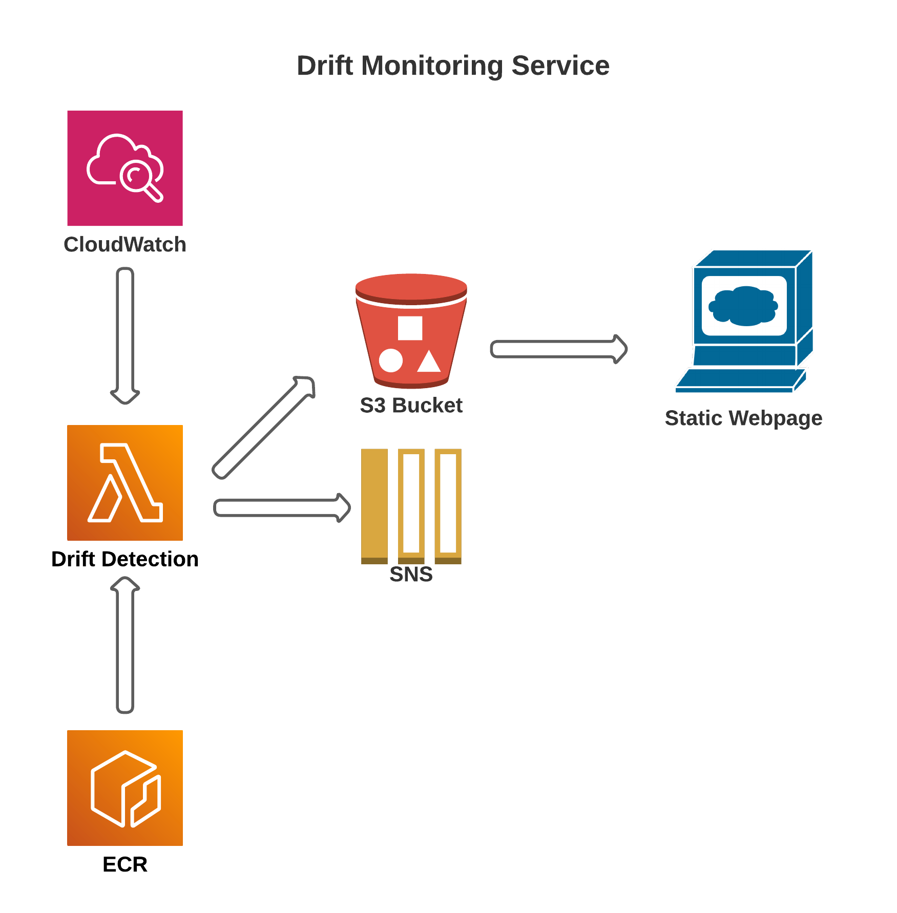

# Drift Monitoring

## Motiviation

One of the most common challenges faced by Data Science teams building production ML systems is addressing data drift. This is because ML systems fail silently and can go undetected until something goes terribly wrong in production. Data drift can be further broken down into the following categories (Huyen, 2022):

1. Covariate shift: the distribution of the input changes, but the conditional probability of an output given an input remains the same (P(X) changes but P(Y|X) remains the same).
2. Label shift: when the output distribution changes, but, for a given output, the input distribution stays the same (P(Y) changes but P(X|Y) remains the same).
3. Concept drift: the input distribution remains the same but the conditional distribution of the output given an input changes.

Data drift affects all batch-based ML systems, causing your ML models to go "stale" and serve suboptimal predictions to your end users. While there are online/continuous ML models (ex: Vowpal Wabbit and River) that learn from data one example at a time, the implementation and maintenance of these systems can be complex and may not be the best choice for all situations.

While most production ML systems have performance evaluation components to trigger model retraining, by comparing historical predictions with the true labels, often this may not be sufficient to detect potential problems with your ML system. 

To ensure that your ML system is robust and serves accurate predictions to your end users, it is imperative to implement drift monitoring services in addition to your performance evaluation component to preemptively alert the Data Science teams when there are potential issues with your ML system. The following are useful examples of attributes to monitor:

1. Distributional shifts in your features
2. Distributional shifts in your target variable
3. Distributional shifts in your model predictions

While monitoring is a powerful method for covariate shifts, it is vital to have a thorough understanding over the reasons behind these shifts in order to drive down potential false positives. Additionally, it is vital to enforce data quality standards upstream to ensure your ML system is learning from high-quality reliable data. Great Expectations is an excellent scalable framework for data quality validation. 

In this project, we focus on monitoring covariate shifts in our input feature space by using the EvidentlyAI library.

## Overview

This monitoring services uses the following AWS components:

- EventBridge (CloudWatch Events): triggers monitoring service on a weekly cadence
- ECR: contains Docker image of monitoring service
- Lambda: serverless monitoring service that calculates drift, writes status to SNS and publishes HTML files for webpage
- S3: hosts the static webpage for Evidently AI drift status
- SNS: contains message of drift status that is emailed to client

Configuration information can be located in docs/setup.md.

## References

Great Expectations, https://docs.greatexpectations.io/docs/, 2022

Halford, Max. River, https://riverml.xyz/0.14.0/, 2022

Huyen, Chip. Designing Machine Learning Systems: An Iterative Process for Production-Ready Applications. O'Reilly Media, Inc., 2022. 

Vowpal Wabbit, https://vowpalwabbit.org, 2022

