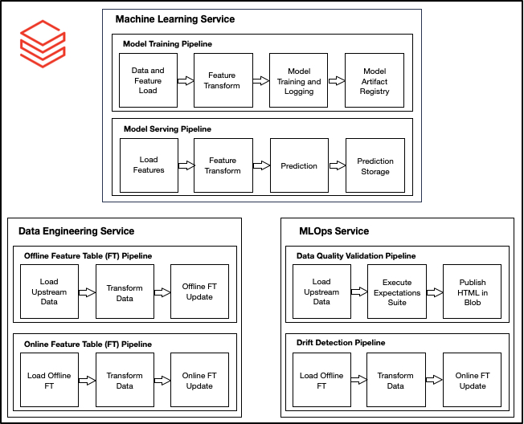

# Databricks Production ML System

## Background
This repository contains an end-to-end Production ML System using Azure Databricks. In this system, we are implementing a single deployment strategy for a batch deployment. All relevant downstream data assets, ML artifacts and MLOps services are scheduled and orchestrated at a regular cadence.

Below are the core services in this ML system:
1. Data Engineering Service: ETL pipelines to create Analytics and Model Ready Data Sets. All pipelines are scheduled to execute at a daily cadence:
    - Offline Feature Table (FT) Pipeline: populates the offline feature store to create the Analytics Ready Data Set (ARDS). This is scheduled to run on a daily cadence.
    - Online Feature Table (FT) Pipeline: populates the online feature store to create the Model Ready Data Set (MRDS). This is scheduled to run on a daily cadence.
2. Machine Learning Service: model training and serving pipelines utilizing Databricks MLflow integration for model artifact management.
    - Model Training Pipeline: trains ML pipeline, which packs both the feature extractor and ML model into a serialized scikit-learn Pipeline object. This is scheduled to run on a daily cadence.
    - Model Serving Pipeline: services ML pipeline for predictions. This is scheduled to run on a daily cadence.
3. MLOps Service: data quality validation and drift detection pipelines to be integrated into downstream CI/CD/CT pipelines. These pipelines will store HTML artifacts in Blob for downstream consumption.
    - Data Quality Validation Pipeline: upstream data quality validation framework for relevant source-aligned data assets. This is scheduled to run on a daily cadence.
    - Drift Detection: drift detection framework to calculate distributional shifts in our ARDS. This is scheduled to run on a monthly cadence. Please visit my existing Drift Detection repository for more information. 

## Orchestration
This ML system consists of 6 pipelines that are scheduled and orchestrated using Databricks Jobs. For full control over your jobs, it is recommended to leverage Azure DevOps while utilizing Databricks CLI. 

