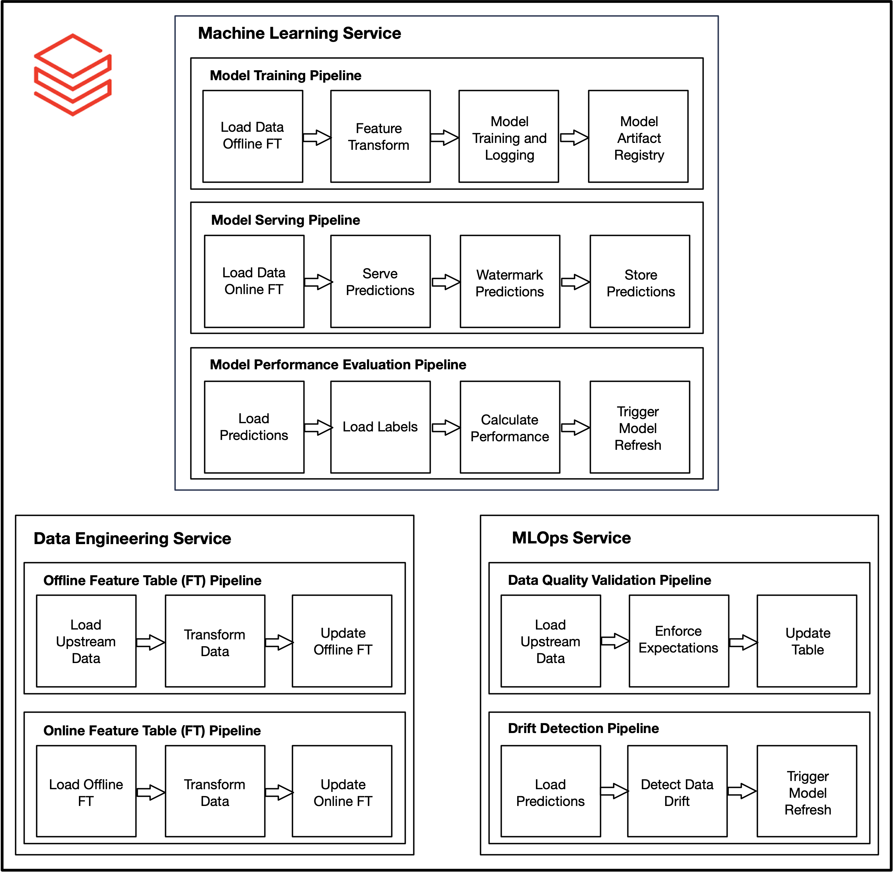

# Databricks Production ML System

## Background
This repository contains an end-to-end production machine learning system using Azure Databricks. In this system, we are implementing a single deployment strategy for a batch deployment. All relevant downstream data assets, ML artifacts and services are scheduled at a regular cadence.

Below are the core services in this ML system:
1. Data Engineering Service
2. Machine Learning Service
3. MLOps Service

This ML System leverages the following technologies:
1. PySpark for Data Engineering Services and Data Quality Validation Pipeline
2. Python for ML pipeline development and Drift Detection Pipeline
3. MLflow for model artifact management
4. Feature Tables for access to high-quality Analytics and Model Ready Data Sets in low latency
5. Great Expectations for Data Quality Validation
6. EvidentlyAI for Drift Detection

## Data Engineering Service

The Data Engineering Service consists of 3 scheduled pipelines that performs ETL from the upstream data assets into downstream feature tables. In this system, the source-aligned data assets are in a CSV format and the downstream data assets resulting from these pipelines are stored in a Delta format and in an Azure SQL Server table. 

Details for the Data Engineering Services and its components can be found in the "data_engineering_service" folder: 
1. Offline Feature Table (FT) Pipeline: populates the offline feature store to create the Analytics Ready Data Set (ARDS). This is updated using the following script and is scheduled to run on a daily cadence:
    - feature_store_training_daily.py
2. Online Feature Table (FT) Pipeline: populates the online feature store to create the Model Ready Data Set (MRDS). This is updated using the following script and is scheduled to run on a daily cadence:
    - feature_store_training_daily.py
    - online_feature_table_daily.py

## Machine Learning Service

The Machine Learning Service consists of 3 scheduled pipelines that leverages the outputs of the Data Engineering Service to train an ML pipeline and use that pipeline to service predictions for downstream consumption. Model training and serving pipelines utilizes the Databricks MLflow integration for model artifact management and the respective Databricks Feature Store tables. Finally, the overall ML pipeline is evaluated and retrained if model has deteriorated.

Details for the Machine Learning Services and its components can be found in the "machine_learning_service" folder: 
1. Model Training Pipeline: trains ML pipeline, which packs both the feature extractor and ML model into a serialized scikit-learn Pipeline object. This is scheduled to run on a monthly cadence.
    - helperfunctions.py
    - training_pipeline.py
2. Model Serving Pipeline: services ML pipeline for predictions. This is scheduled to run on a daily cadence.
    - helperfunctions.py
    - serving_pipeline.py
3. Model Performance Evaluation Pipeline: evaluates ML pipeline on last 31 days worth of data (accounting for a 1-day label delay) and triggers model retraining based on acceptable performance of ML pipeline.
    - helperfunctions.py
    - performance_evaluation_pipeline.py

## MLOps Service

The MLOps Service consists of 2 scheduled pipelines that leverages the outputs of the Data Engineering Service and the Machine Learning Service to validate the integrity of the data assets and detect any data drift. The data quality validation and drift detection pipelines will be integrated into downstream CI/CD/CT and alerting functionalities. These pipelines will store HTML artifacts in Blob and DBFS for downstream consumption.

Details for the MLOps Services and its components can be found in the "mlops_service" folder: 
1. Data Quality Validation Pipeline: upstream data quality validation framework for relevant data assets. This is scheduled to run on a daily cadence.
    - validation.py
2. Drift Detection: drift detection framework to calculate distributional shifts in our ARDS. This is scheduled to run on a monthly cadence.
    - helperFunctions.py
    - drift_detection.py

## Orchestration
This ML system consists of various pipelines that are orchestrated using Databricks Jobs. For full control over your jobs, test converge, and CI/CD/CT, it is recommended to leverage Azure DevOps and the Databricks CLI. It is also recommended to utilize the GitHub Databricks integration for orchestration of the Databricks Jobs/Azure DevOps Pipelines.

