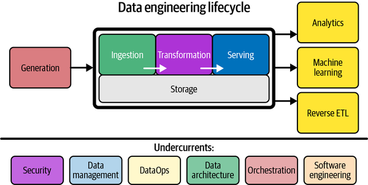
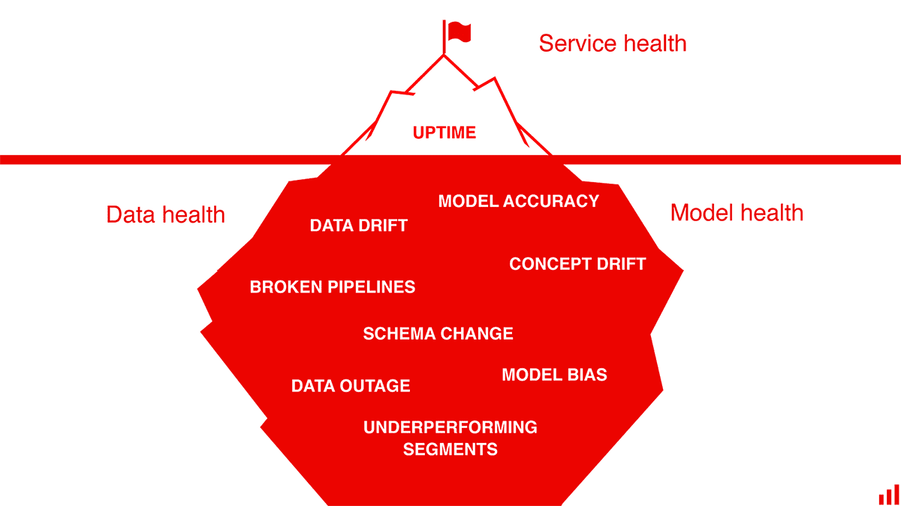

# Data Quality Monitoring
## Motivation

The backbone to successful ML Systems and Data Science products are the foundational data pipelines that takes data from the source and creates a valuable representation to be served to various downstream consumers. These pipelines ensure that the data served to downstream consumers are reliable, available and of high quality. 

A hidden technical debt many Data teams face is not implementing proper monitoring of the data assets used by various downstream consumers, such as dashboards or ML systems. Due to the complexity of many ETL pipelines and the various points of failure in the Data Engineering Lifecycle, it is vital to implement data quality monitoring throughout the lifecycle to validate the data. This ensures that the data served to all downstream consumers are reliable and of high-quality. Great Expectations is an excellent scalable framework for data quality validation and monitoring. 

Given your data assets and the expectations, which are the expected representation of different elements in your data asset, Great Expectations will provide the following functionalities:
- Expectation Validation: framework to check whether your data asset is represented as expected
- Reporting: data documentation and data quality reports
- Alerting: logging and alerting based on expectation validation

When monitoring production ML systems, it is imperative we monitor:
- Data health: monitoring of our upstream data assets (ex: schema changes, broken pipelines, etc.)
- Model health: monitoring of different ML components (ex: concept/covariate drift etc.)
- Service health: monitoring of overall resources and infrastructure

In this project, we focus on monitoring the Data health by leveraging Great Expectations for Expectation Validation and Reporting. 

## Overview

## References
EvidentlyAI, https://www.evidentlyai.com, 2022

Great Expectations, https://docs.greatexpectations.io/docs/, 2022

Reis, Joe, and Matt Housely. Fundamentals of Data Engineering: Plan and Build Robust Data 
    Systems. O'Reilly, 2022.
